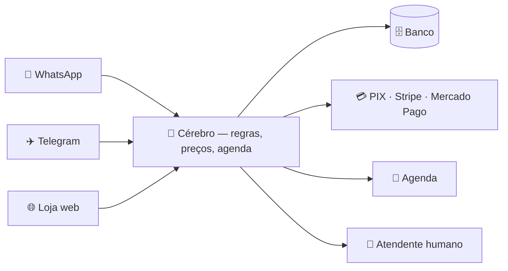

  

  
  
  
  

---

Eu sou o **Alisson Santos**, fundador da **Autark**. Construo sistemas que trabalham sozinhos: fluxos de **WhatsApp + IA** que vendem, atendem e agendam 24/7, SaaS completos e integrações que eliminam trabalho manual.

A Autark é o meu estúdio — quem atende, constrói e entrega sou eu. Tecnólogo em **Gestão da Tecnologia da Informação**: antes de abrir o editor, eu entendo o objetivo de negócio por trás do projeto.

📍 Lorena, São Paulo · 🌎 100% remoto · ⚡ resposta no mesmo dia

 

## 🚀 Sistemas rodando de verdade

> As imagens abaixo são **capturas reais** dos sistemas em execução — não mockups.

<table>
<tr>
<td width="50%" valign="top">

### AgendaZap · SaaS · IA · WhatsApp

Agenda inteligente para salões e barbearias. O cliente marca sozinho pelo link ou conversando com a IA no WhatsApp; o sistema confirma, lembra e cobra.

`Next.js 16` `Supabase + RLS` `Gemini` `Evolution API` `Mercado Pago`

**[▶ Demo ao vivo](https://agendazap-three.vercel.app)** · [testar agendamento](https://agendazap-three.vercel.app/b/demo)

</td>
<td width="50%" valign="top">

### CRM RealCred+ · API oficial da Meta

Inbox omnichannel em operação financeira real: campanhas com governança de templates, opt-out, auditoria e retenção LGPD. ~28ms de latência, zero cold start.

`Fastify` `React` `Prisma` `Postgres 17` `BullMQ` `Fly.io`

**[▶ App em produção](https://realcred-whatsapp-crm.fly.dev)**

</td>
</tr>
<tr>
<td width="50%" valign="top">

### Bia · delivery multicanal

Assistente de delivery para supermercado com **6.438 produtos** do ERP. Loja web PWA, Telegram e WhatsApp desaguam no mesmo cérebro; o cupom sai na impressora do balcão.

`Node.js puro` `PWA` `Telegram API` `Meta Cloud API` `ESC/POS`

**487 testes automatizados, todos verdes** · zero dependência em runtime

</td>
<td width="50%" valign="top">

### Marvet · catálogo + SEO

Catálogo de mudas de pastagem onde **cada cultivar tem página própria** — porque o Google posiciona páginas, não sites. Adicionar uma muda é editar um arquivo.

`Next.js 16` `React 19` `TypeScript` `Tailwind v4`

SEO, sitemap e dados estruturados nascem sozinhos

</td>
</tr>
<tr>
<td width="50%" valign="top">

### ParkNow · SaaS B2B2C

Estacionamento inteligente: painel web, app mobile offline-first, mapa em tempo real e **PIX sem gateway** (BR Code gerado localmente).

`Turborepo` `Next.js` `React Native` `Supabase + PostGIS` `Socket.IO`

**[↗ Código aberto](https://github.com/ParkNow914/ParkNow)**

</td>
<td width="50%" valign="top">

### FlowHub · CRM SaaS

CRM para pequenos negócios: leads com score, pipeline kanban, command palette ⌘K, RBAC de 4 papéis e audit log com before/after.

`Next.js 15` `TypeScript` `Prisma` `PostgreSQL` `shadcn/ui`

**[↗ Código aberto](https://github.com/ParkNow914/flowhub)**

</td>
</tr>
</table>

  <a href="https://parknow914.github.io/#projetos"><b>👉 Ver os 8 sistemas com estudo de caso completo</b></a>

 

## 🧠 O Cérebro Autark

Três decisões de arquitetura que eu levo para todo projeto — é o que faz o sistema aguentar o mundo real:

| | Decisão | Por que importa |
|---|---|---|
| **1** | **Um cérebro, canais infinitos** | A lógica não sabe de qual canal veio a mensagem. Quando o WhatsApp de um cliente caiu no meio do projeto, Telegram e loja web entraram sem reescrever uma regra. |
| **2** | **Testado antes de você depender** | Cada regra vira teste automatizado. O sistema não "aprende no cliente" — entra no ar já sabendo o que fazer. |
| **3** | **Plugado nos seus sistemas** | Não é chatbot de resposta pronta: conversa com banco, pagamento e agenda, então resolve o pedido em vez de empurrar pro humano. |

 

## 🛠️ Stack

<b>O que eu uso no dia a dia</b>

 

**Front-end**
`React` `Next.js` `React Native / Expo` `TypeScript` `Tailwind CSS` `shadcn/ui`

**Back-end**
`Node.js` `Fastify` `Express` `Hono` `Python` `APIs REST` `JWT` `Argon2id`

**Dados & Infra**
`PostgreSQL` `Supabase` `Prisma` `Drizzle` `Redis / BullMQ` `Docker` `GitHub Actions` `Fly.io` `Vercel` `Cloudflare`

**Automação & IA**
`n8n` `Evolution API` `Meta Cloud API` `GPT` `Claude` `Gemini` `RAG` `agentes`

**Marketing & Dados**
`Google Tag Manager` `GA4` `Meta Pixel` `Conversions API` `SEO técnico` `Core Web Vitals`

<b>Como eu trabalho</b>

 

1. **Diagnóstico** — conversa direta para entender o objetivo de negócio, não só o que você quer construir.
2. **Proposta clara** — escopo, prazo e valor por escrito antes de qualquer pagamento.
3. **Entregas visíveis** — você acompanha versões funcionando, sem sumiço de semanas.
4. **Entrega + suporte** — publicado, testado e documentado; acompanho a estabilização.

Pego **poucos projetos por vez**, de propósito: é o que permite responder no mesmo dia e cumprir prazo.

 

## 📈 Números que importam

<table>
<tr>
<td align="center" width="25%"><h2>5.0 ★</h2>nota no 99freelas</td>
<td align="center" width="25%"><h2>100%</h2>clientes que recomendam</td>
<td align="center" width="25%"><h2>8</h2>sistemas no portfólio</td>
<td align="center" width="25%"><h2>487</h2>testes só no maior deles</td>
</tr>
</table>

 

## 💬 Vamos conversar

Me conte o que você precisa automatizar ou construir — respondo no mesmo dia e já te mostro um sistema parecido funcionando ao vivo.

  
  

  <b>Autark</b> · por Alisson Santos · <a href="https://parknow914.github.io/">parknow914.github.io</a>

