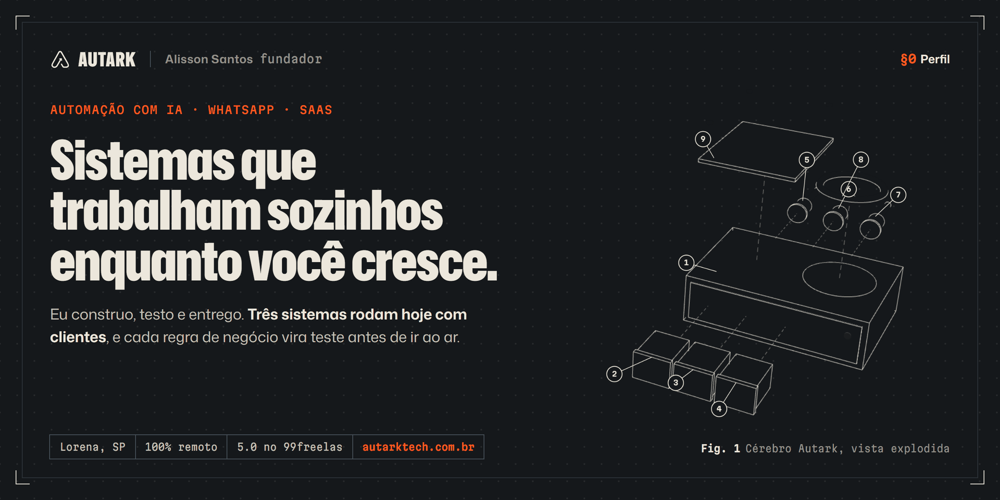
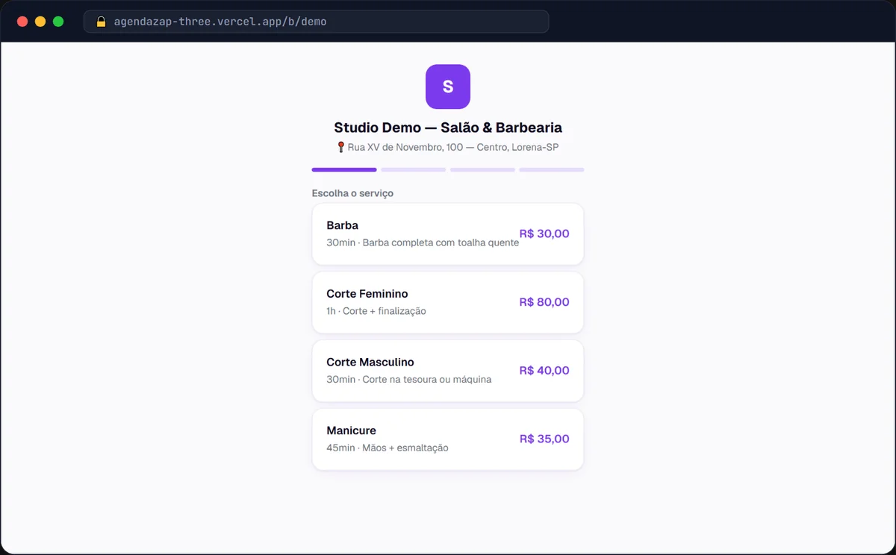
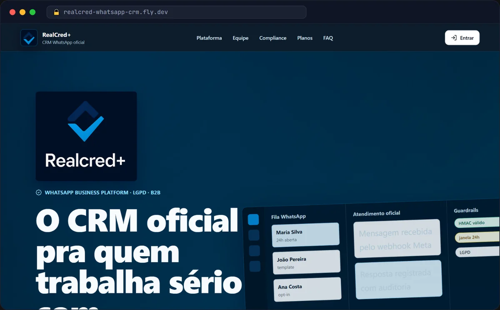
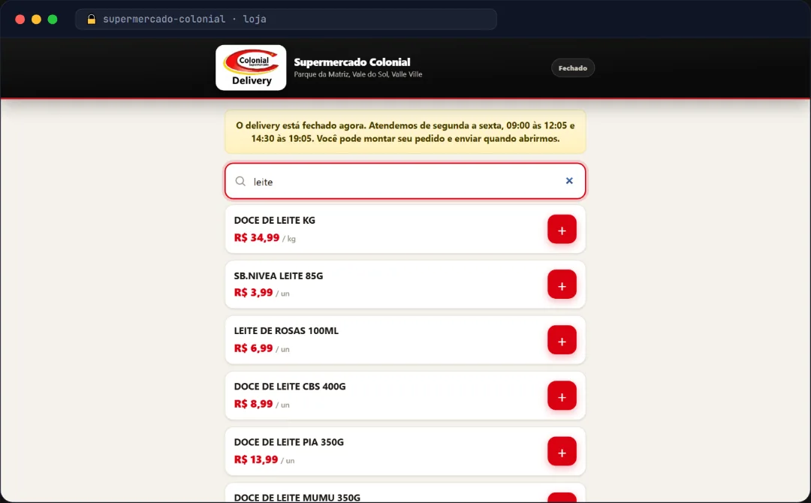
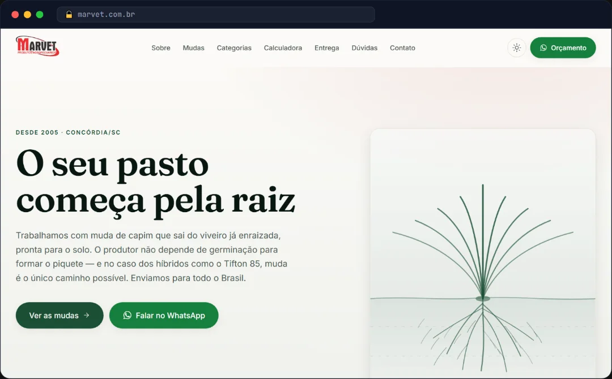
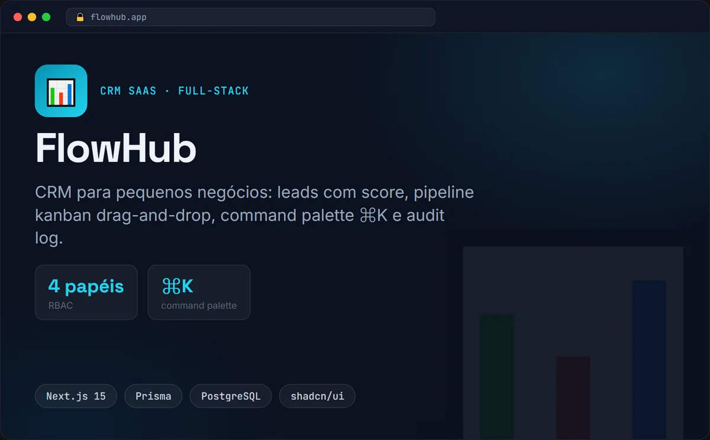
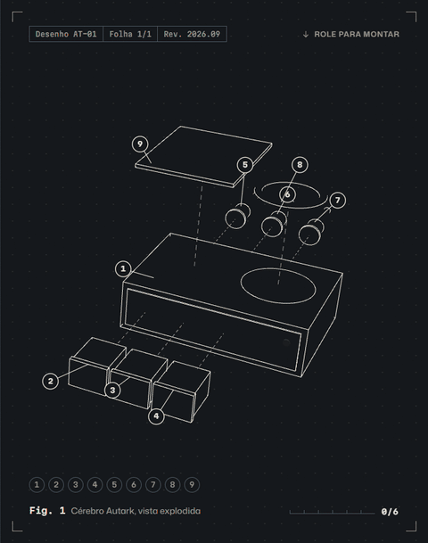

  
  
  
  

Eu sou o **Alisson Santos**, fundador da **[Autark](https://autarktech.com.br/)**. Construo sistemas que trabalham sozinhos: atendimento de WhatsApp com IA que vende, atende e agenda a qualquer hora, SaaS completos e integrações que tiram o trabalho manual do seu negócio.

A Autark é uma pessoa só, e é por isso que funciona. Você não passa por agência nem gerente de conta: quem atende, constrói e entrega sou eu. Antes de abrir o editor eu entendo o objetivo de negócio do projeto, hábito que vem da minha formação em Gestão da Tecnologia da Informação.

Lorena, SP · atendo o Brasil inteiro, 100% remoto · resposta no mesmo dia

## §1 Sistemas em operação

Capturas reais dos sistemas rodando. Cada um tem a situação de hoje escrita ao lado, do jeito que está no [registro do site](https://autarktech.com.br/#sistemas).

<table>
<tr>
<td width="50%" valign="top">

**SYS-01 · AgendaZap**  
SaaS · IA · WhatsApp

Agenda para salão, barbearia e estética. O cliente marca sozinho pelo link ou conversando com a atendente de IA no WhatsApp, e os lembretes de 24h e 2h antes derrubam o bolo.

`Next.js 16` `Supabase` `Gemini` `Evolution API` `Mercado Pago`

**[Abrir a demo](https://agendazap-three.vercel.app)** · [testar um agendamento](https://agendazap-three.vercel.app/b/demo)

</td>
<td width="50%" valign="top">

**SYS-02 · CRM de WhatsApp**  
CRM · API oficial da Meta

Inbox e CRM que rodou em operação financeira real, com campanhas sob governança de templates, opt-out, auditoria e retenção LGPD. Seguia estável até o dia em que o cliente encerrou a operação por custo de infraestrutura.

`Fastify` `React` `Prisma` `Postgres 17` `BullMQ` `Fly.io`

12 workflows de CI · ~28 ms até o banco

</td>
</tr>
<tr>
<td width="50%" valign="top">

**SYS-05 · Bia**  
Delivery multicanal · IA · supermercado de bairro

Catálogo de 6.438 produtos importado do ERP. Loja web, Telegram e WhatsApp caem no mesmo cérebro, e o cupom sai impresso direto no balcão.

`Node.js` `PWA` `Telegram API` `Meta Cloud API` `ESC/POS`

**487 testes automatizados, todos verdes**

</td>
<td width="50%" valign="top">

**SYS-07 · Marvet**  
Site e catálogo · SEO · agropecuária de Santa Catarina

Cada cultivar ganhou página própria, porque quem busca "muda de tifton 85" precisa cair numa página sobre tifton 85. Adicionar uma muda é editar um arquivo.

`Next.js 16` `React 19` `TypeScript` `Tailwind v4`

1 arquivo = 1 página

</td>
</tr>
<tr>
<td width="50%" valign="top">

**SYS-04 · ParkNow**  
SaaS B2B2C · web + mobile

Estacionamento inteligente: painel web, app mobile que funciona offline, mapa em tempo real e PIX com BR Code gerado localmente, sem gateway pago.

`Turborepo` `Next.js` `React Native` `Supabase + PostGIS` `Socket.IO`

**[Ver o código](https://github.com/ParkNow914/ParkNow)**

</td>
<td width="50%" valign="top">

**SYS-06 · FlowHub**  
CRM SaaS · código aberto

CRM para pequenos negócios: leads pontuados, pipeline kanban, command palette, quatro papéis de acesso e audit log com o antes e o depois de cada alteração.

`Next.js 15` `TypeScript` `Prisma` `PostgreSQL` `shadcn/ui`

**[Ver o código](https://github.com/ParkNow914/flowhub)**

</td>
</tr>
</table>

<b>Registro completo: os 10 sistemas</b>

 

| Código | Sistema | Tipo | Situação | Ver |
|---|---|---|---|---|
| SYS-01 | AgendaZap | SaaS · IA · WhatsApp | Em produção | [demo](https://agendazap-three.vercel.app) |
| SYS-02 | CRM de WhatsApp | CRM · API oficial da Meta | Encerrado pelo cliente | [no site](https://autarktech.com.br/#sys-02) |
| SYS-03 | JurisIA | IA jurídica · SaaS B2B | Produto próprio | [no site](https://autarktech.com.br/#sys-03) |
| SYS-04 | ParkNow | SaaS B2B2C · web + mobile | Produto próprio | [código](https://github.com/ParkNow914/ParkNow) |
| SYS-05 | Bia | Delivery multicanal · IA | Entregue | [no site](https://autarktech.com.br/#sys-05) |
| SYS-06 | FlowHub | CRM SaaS · código aberto | Produto próprio | [código](https://github.com/ParkNow914/flowhub) |
| SYS-07 | Marvet | Site e catálogo · SEO | Entregue | [no site](https://autarktech.com.br/#sys-07) |
| SYS-08 | RealCred+ | Landing + simulador | Entregue | [código](https://github.com/ParkNow914/realcredmais) |
| SYS-09 | Índice de Gestão | Diagnóstico · agronegócio | Em produção | [no site](https://autarktech.com.br/#sys-09) |
| SYS-10 | Acerto | SaaS · crédito consignado | Produto próprio | [demo](https://acerto-comissao.netlify.app) |

## §2 O Cérebro Autark

<table>
<tr>
<td width="42%" valign="top">
<picture>
  <source srcset="assets/fig1-montagem.webp" type="image/webp" />
  
</picture>

Fig. 1 do <a href="https://autarktech.com.br/#montagem">site</a>, capturada da própria cena 3D

</td>
<td valign="top">

Todo sistema que eu entrego é montado com as mesmas nove peças: um núcleo de regras, as portas de atendimento, os conectores com o que você já usa, a bancada de testes e o fechamento com documentação. Três decisões fazem ele aguentar o mundo real.

**1. Um cérebro, vários canais.** A lógica não sabe de qual canal veio a mensagem. Quando o WhatsApp de um cliente caiu no meio do projeto, Telegram e loja web entraram sem reescrever uma regra.

**2. Testado antes de você depender.** Cada regra vira teste automatizado. O sistema entra no ar sabendo o que fazer e continua certo depois de cada mudança.

**3. Plugado nos seus sistemas.** Conversa com banco, pagamento e agenda, então resolve o pedido em vez de empurrar para um humano.

</td>
</tr>
</table>

## §3 Relatório de campo

Sete avaliações no 99freelas, todas 5.0, com 100% de recomendação. Duas delas, como o cliente escreveu:

> Recomendo a todos, um ótimo profissional e de muito conhecimento, sempre atendendo com rapidez todas as demandas solicitadas.
>
> Fluxo para delivery de supermercado · jul. 2026

> Muito prestativo e profissional, sem dúvidas se precisar novamente voltarei a contratar os serviços dele, super recomendo!!!
>
> Landing page para produto low ticket · jun. 2026

<table>
<tr>
<td align="center" width="25%"><h2>5.0 ★</h2>nota no 99freelas</td>
<td align="center" width="25%"><h2>100%</h2>dos clientes recomendam</td>
<td align="center" width="25%"><h2>10</h2>sistemas no registro</td>
<td align="center" width="25%"><h2>487</h2>testes só no maior deles</td>
</tr>
</table>

## §4 Ferramentas

<b>O que eu uso no dia a dia</b>

 

**Front-end** · `React` `Next.js` `React Native / Expo` `TypeScript` `Tailwind CSS` `shadcn/ui` `Three.js`

**Back-end** · `Node.js` `Fastify` `Express` `Hono` `Python` `APIs REST` `JWT` `Argon2id`

**Dados e infra** · `PostgreSQL` `Supabase` `Prisma` `Drizzle` `Redis / BullMQ` `Docker` `GitHub Actions` `Fly.io` `Vercel` `Cloudflare`

**Automação e IA** · `n8n` `Evolution API` `Meta Cloud API` `GPT` `Claude` `Gemini` `RAG` `agentes`

**Marketing e dados** · `Google Tag Manager` `GA4` `Meta Pixel` `Conversions API` `SEO técnico` `Core Web Vitals`

<b>Como eu trabalho</b>

 

1. **Diagnóstico.** Uma conversa para entender o objetivo de negócio, além do que você quer construir.
2. **Proposta por escrito.** Escopo, prazo e valor fechados antes de qualquer pagamento.
3. **Entregas visíveis.** Você acompanha versões funcionando ao longo do projeto e aprova cada etapa.
4. **Entrega e suporte.** Publicado, testado e documentado. Depois do lançamento eu acompanho a estabilização.

Pego poucos projetos por vez, de propósito: é o que permite responder no mesmo dia e cumprir prazo.

## §5 Assistência técnica

Me conte o que você quer automatizar ou construir. Respondo no mesmo dia e já mostro um sistema parecido funcionando.

  
  

---

<b>Autark</b> · Manual de Operação · Rev. 2026.09 · <a href="https://autarktech.com.br/">autarktech.com.br</a> · <a href="https://github.com/ParkNow914/ParkNow914.github.io">código do site</a>

